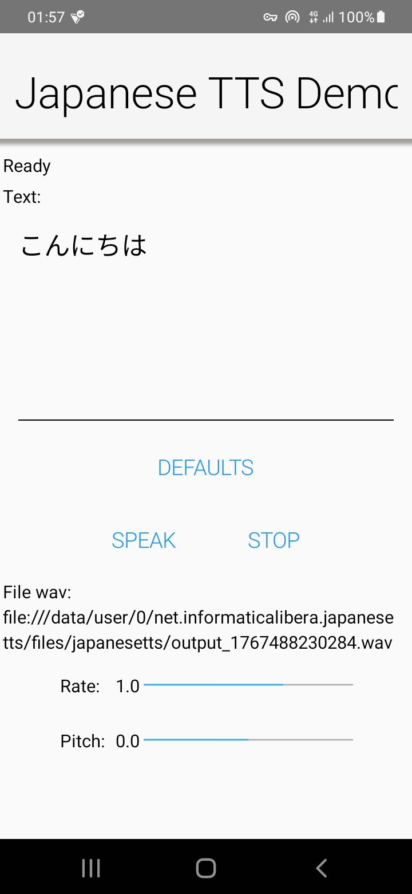

# Nihonjindes Japanese TTS - Android implementation for Codename One

by [Francesco Galgani](https://www.informatica-libera.net/)

Offline Japanese text-to-speech (TTS) on Android for **Codename One** apps, powered by **Open JTalk** with the **Mei (Normal)** voice.

> **Scope**
>
> The initial objective was to publish this work as a reusable **CN1Lib**.
>
> **Current state:** the repository provides **two reference projects** (Codename One + Android Studio) that demonstrate a working Japanese text-to-speech demo.
>
> Packaging as a turn‑key CN1Lib is intentionally left for a future version.
>
> The Android Studio project has been tested and works on both physical devices and the Android Studio emulator.
>
> *japanese-tts-app-debug.apk* allows for immediate testing.



## Repository contents

This repository is organized around two complementary projects:

1. **Codename One reference project**

   The “source of truth”: Java-side API, demo UI, Android native implementation, and packaged assets (dictionary + voice).

2. **Android Studio reference project (transcompiled from the Codename One project)**

   Exported from Codename One as Android sources and then opened in Android Studio for debugging.

**Important:** the Android Studio project is **derived output**. Any functional change should be made in the Codename One project and then re‑transcompiled.

## Requirements

### Android Studio project
- **Java 17**
- **Gradle 8.1**

These requirements match the reference Android Studio build used during development.

## Try the reference voice (online demo)

To preview the same voice used here:

- https://open-jtalk.sp.nitech.ac.jp/index.php → select **“Mei (Normal)”**

## Technical overview

### Runtime pipeline (Android)

At runtime the Android native layer:

1. Extracts the **dictionary** and **voice** from packaged resources into the app’s **internal storage** (app home directory).
2. Runs **Open JTalk** via `ProcessBuilder` and produces a WAV file in the same working directory.
3. The Codename One layer plays the WAV via an **InputStream-based** media source.

### Why execute from `nativeLibraryDir`?

On Android 10+ (SELinux), executing native code from arbitrary app-private directories can be blocked.
This implementation executes Open JTalk from `nativeLibraryDir` to avoid `execute_no_trans`/permission issues.

### Why InputStream playback?

On some devices/OS versions, using a `file://` URI with the underlying Android media stack can trigger storage/media permission prompts.
InputStream-based playback reduces the probability of those prompts, though behavior may still vary depending on Android version and Codename One implementation.

## API surface (reference)

The reference API exposed to the Codename One app side includes:

- `JapaneseTTS.isSupported()`
- `JapaneseTTS.synthesizeToWav(String text)` → returns the WAV path (or `null` on error)
- `JapaneseTTS.setSpeechRate(float rate)`
  Controls speed (maps to Open JTalk `-r`). Default is `1.0`.
- `JapaneseTTS.setPitch(float pitch)`
  Controls pitch offset (maps to Open JTalk `-fm`). Default is `0.0`.
- `JapaneseTTS.resetVoiceParams()`  
  Restores defaults (rate/pitch).

The demo UI includes sliders for **Rate** and **Pitch**, plus a **Defaults** button.

## Notes and known behavior

### Manual native library copy (required)

The transcompiled Android Studio project does **not** automatically include the native `.so` libraries.
You must copy them manually into the Android Studio project before running.

Below are the exact commands used during development on Linux:

```bash
cd japanese-tts-androidstudio

# Find the folder containing the .so files in the CN1 project (robust, not hardcoded).
SRC_DIR="$(find ~/ProjectForCN1Lib -type d -path '*/jniLibs' \
  -exec test -f '{}/arm64-v8a/libopen_jtalk.so' \; -print | head -n 1)"

echo "SRC_DIR=$SRC_DIR"
test -n "$SRC_DIR" || { echo "ERROR: I cannot find jniLibs with libopen_jtalk.so"; exit 1; }

# Destination specified by Gradle/Android Studio
DST_DIR="app/src/main/jniLibs"
mkdir -p "$DST_DIR"

# Copy all available ABIs (arm64-v8a, armeabi-v7a, x86_64)
cp -av "$SRC_DIR"/* "$DST_DIR"/

ls -la app/src/main/jniLibs/arm64-v8a/
```

After copying, you should see per ABI:
- `libopen_jtalk.so`
- `libc++_shared.so`

If you re‑transcompile/re‑export the Android sources, repeat this copy step.

### Other notes

- **First synthesis is slower.** Dictionary/voice extraction happens on first use and can take seconds.
- **Storage permission prompt may appear on some devices.**
  Codename One’s media layer and Android’s permission model can trigger an initial permission UI depending on OS/device.
- **Supported ABIs:** `arm64-v8a`, `armeabi-v7a`, and `x86_64` (as built in the reference setup).
- **Platform scope:** this repository implements **Android** offline TTS. Other platforms are out of scope for the current implementation.

## Third‑party software

This project depends on the following upstream components (versions and verified hashes as used in development):

```text
# --- Pinned artifacts (URLs + SHA-256) ---
# Sources:
# - These pins match the widely used Homebrew open-jtalk formula (as of Dec 2025) for OpenJTalk + HTS Engine + MMDAgent example.
OPENJTALK_VER="1.11"
OPENJTALK_URL="https://downloads.sourceforge.net/project/open-jtalk/Open%20JTalk/open_jtalk-1.11/open_jtalk-1.11.tar.gz"
OPENJTALK_TAR="open_jtalk-${OPENJTALK_VER}.tar.gz"
OPENJTALK_SHA256="20fdc6aeb6c757866034abc175820573db43e4284707c866fcd02c8ec18de71f"

HTS_ENGINE_VER="1.10"
HTS_ENGINE_URL="https://downloads.sourceforge.net/project/hts-engine/hts_engine%20API/hts_engine_API-1.10/hts_engine_API-1.10.tar.gz"
HTS_ENGINE_TAR="hts_engine_API-${HTS_ENGINE_VER}.tar.gz"
HTS_ENGINE_SHA256="e2132be5860d8fb4a460be766454cfd7c3e21cf67b509c48e1804feab14968f7"

OPENJTALK_DIC_VER="1.11"
OPENJTALK_DIC_URL="https://downloads.sourceforge.net/project/open-jtalk/Dictionary/open_jtalk_dic-1.11/open_jtalk_dic_utf_8-1.11.tar.gz"
OPENJTALK_DIC_TAR="open_jtalk_dic_utf_8-${OPENJTALK_DIC_VER}.tar.gz"
# Note: SourceForge doesn't publish an official SHA-256 on the download page.
# This pin corresponds to the canonical tarball currently served by SourceForge.
OPENJTALK_DIC_SHA256="33e9cd251bc41aa2bd7ca36f57abbf61eae3543ca25ca892ae345e394cb10549"

MMDAGENT_EXAMPLE_VER="1.8"
MMDAGENT_EXAMPLE_URL="https://downloads.sourceforge.net/project/mmdagent/MMDAgent_Example/MMDAgent_Example-1.8/MMDAgent_Example-1.8.zip"
MMDAGENT_EXAMPLE_ZIP="MMDAgent_Example-${MMDAGENT_EXAMPLE_VER}.zip"
MMDAGENT_EXAMPLE_SHA256="f702f2109a07dca103c7b9a5123a25c6dda038f0d7fcc899ff0281d07e873a63"
```

See **ATTRIBUTION.md** for licenses and notices.

## License

All original work of [Francesco Galgani](https://www.informatica-libera.net/) in this repository is released under **CC0 1.0 Universal**.
Third‑party components are licensed under their respective licenses; see **ATTRIBUTION.md**.

